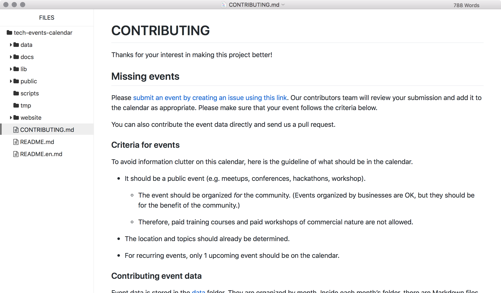

# typora-primer-theme
A Typora theme based on [Primer](https://primer.github.io/), the design system that powers GitHub. This means your Markdown document will render the same way as on GitHub.

## Screenshot

## How to use

[Download this repository](https://github.com/dtinth/typora-primer-theme/archive/master.zip) and copy `primer.css` and `primer` folder inside the `themes` folder into Typora’s `themes` folder.

## License

MIT, same as Primer.
